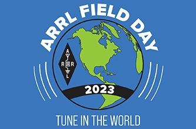

[2025 Field Day Stats are here](results/2025/2025-arrl-fd-stats.txt)

([Winter Field Day information is here](/fieldday/winterfieldday)).

## Field Day 2025 at Blankley Park in Rainsburg, PA

 

ARRL Field Day and VE Session – Field Day is the most popular on-the-air event held annually in the US and Canada. On the fourth weekend of June, more than 35,000 radio amateurs gather with their clubs, groups or simply with friends to operate from remote locations.

Join BCARS this June on Saturday the 28th at 1PM through Sunday the 29th at Blankley Picnic Area in Rainsburg, PA. For 24 hours, Licensed amateurs will be demonstrating amateur radio operation, using emergency power, and field expedient antenna design. Visitors will be given an opportunity to get on the air and make contacts (Get On the Air).

## Directions
R
Field Day 2025 will be held at Blankley Picnic Area off Blankley Road in Rainsburg, PA.  Use the google maps link. You will take PA-326 up Martin Hiil and hang a right on Blankley Road, follow it 2.9 Miles to the picnic area.  BCARS will place some signs or markers along th way.

[VF52+HH9 Rainsburg, Pennsylvania](https://maps.app.goo.gl/2N8W9Px7uW8xE3cS7)

## VE License Exam

For individuals wishing to get their amateur radio license, BCARS will also be hosting an all day VE licensing session on Saturday. [PLEASE REGISTER ON EXAMTOOLS](https://ham.study/sessions/679fc5d44c2b5b77ccd5ceb0/1). You will need your FCC Registration Number to take the exam. Our VE team will be on-hand to administer the exam anytime during the field day event. This session includes the three Amateur Radio license classes, TECHNICIAN, GENERAL, and AMATEUR EXTRA. There is no cost for the exam. If you are going for your amateur license, please bring a recent photo ID (example: school ID, US passport, driver’s license), or a current FCC license.

 

Please visit www.bcars.org for more information.
