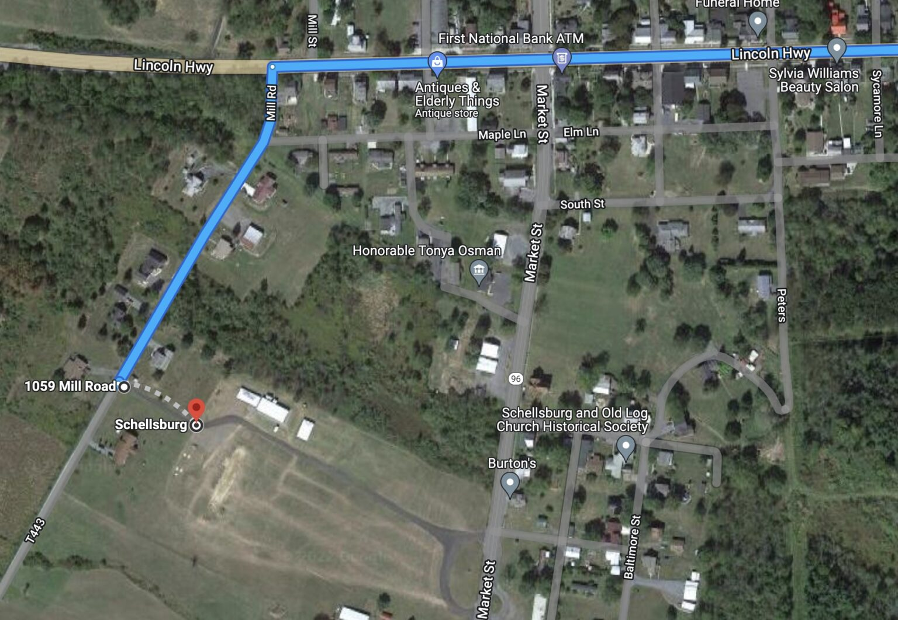

([Winter Field Day information is here](/fieldday/winterfieldday)).

## Field Day 2023 in Schellsburg

 

ARRL Field Day and VE Session – 2023ARRL Field Day is the most popular on-the-air event held annually in the US and Canada. On the fourth weekend of June, more than 35,000 radio amateurs gather with their clubs, groups or simply with friends to operate from remote locations.

Join BCARS this June on Saturday the 24th at 1PM through Sunday the 25th at Shawnee Valley Fire Department Picnic Area in Schellsburg, PA. For 24 hours, Licensed amateurs will be demonstrating amateur radio operation, using emergency power, and field expedient antenna design. Visitors will be given an opportunity to get on the air and make contacts (Get On the Air).

## Directions

[Google Maps Link. Turn off is on the left between 1074 and 1048 Mills Rd, Schellsburg, PA.](https://goo.gl/maps/SVF7GNyRLHUPPrpn9)

Using Mill Rd, past KC3KHK's house.

Alternatively, you  may find it easier to come in on Route 96. Turn off of 30 at the light onto 96 South and look
for the Shawnee Valley Fire Department Picnic Area sign on the right. 

## VE License Exam

For individuals wishing to get their amateur radio license, BCARS will also be hosting an all day VE licensing session on Saturday. [PLEASE REGISTER ON EXAMTOOLS.](https://hamstudy.org/sessions/6366ca1aa998cea5ccb0a3c2/1) You will need your FCC Registration Number to take the exam. Our VE team will be on-hand to administer the exam anytime during the field day event. This session includes the three Amateur Radio license classes, TECHNICIAN, GENERAL, and AMATEUR EXTRA. There is no cost for the exam. If you are going for your amateur license, please bring a recent photo ID (example: school ID, US passport, driver’s license), or a current FCC license.

 

Please visit www.bcars.org for more information.
