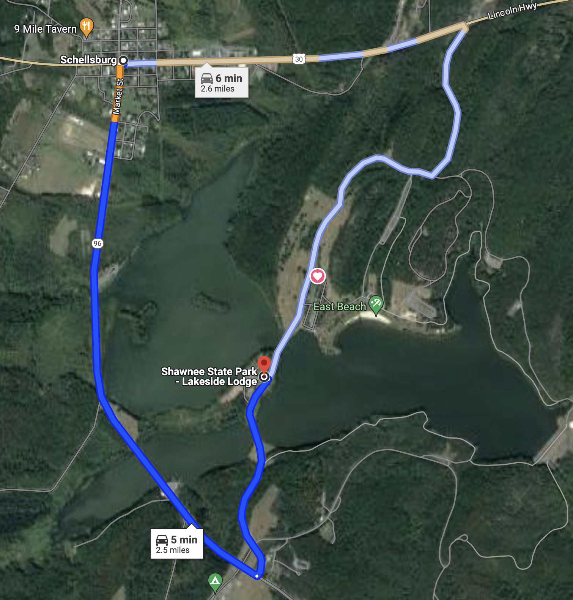

## Winter Field Day 2025 at Shawnee State Park Lodge

 

2025 Winter Field day is **January 25th & 26th**. 

Winter Field Day is a communications exercise. WFD is held on the last full weekend in January. WFD can be worked from the comfort of your home or in a remote location. You can participate by yourself or get your friends, family, or whole club involved. Winter Field Day is open to participants worldwide. Amateur radio operators may use frequencies on the HF, VHF, or UHF bands and are free to use any mode that can faithfully transmit the required exchange intact. Similar to the ARRL’s Field Day, bonus points are earned in several ways, including using non-commercial power sources, operating from remote locations, satellite contacts, and more.

Join BCARS this January on **Saturday the 25th at 1PM through Sunday the 26th** at Shawnee State Park Lakeside Lodge. For 24 hours, Licensed amateurs will be demonstrating amateur radio operation, using emergency power, and field expedient antenna design. Visitors will be given an opportunity to get on the air and make contacts (Get On the Air).

## Directions

[Google Maps Link. Shawnee State Park - Lakeside Lodge, 441 State Park Rd, Schellsburg, PA 15559](https://maps.app.goo.gl/ehjfCPmE55P7oV6p7)

Using Mill Rd, past KC3KHK's house .

 

Please visit www.bcars.org for more information.
